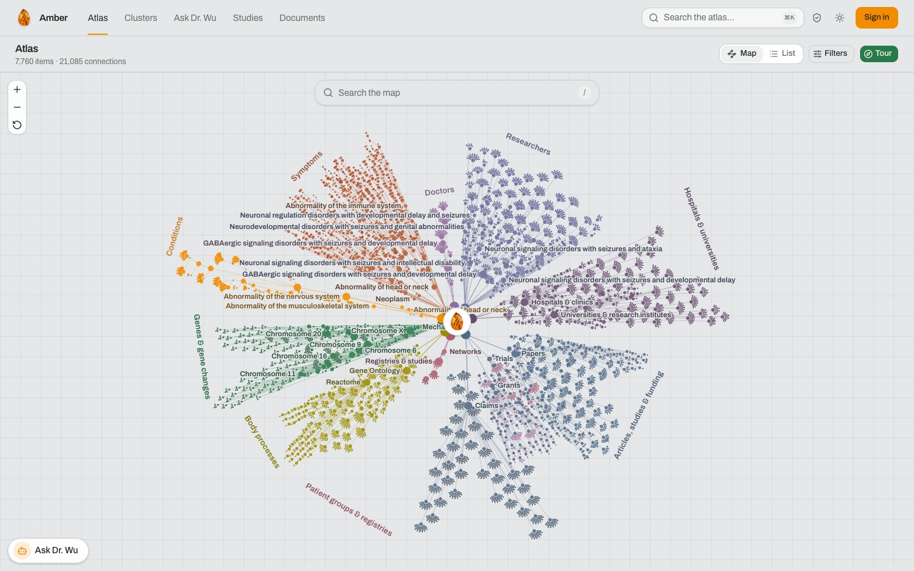
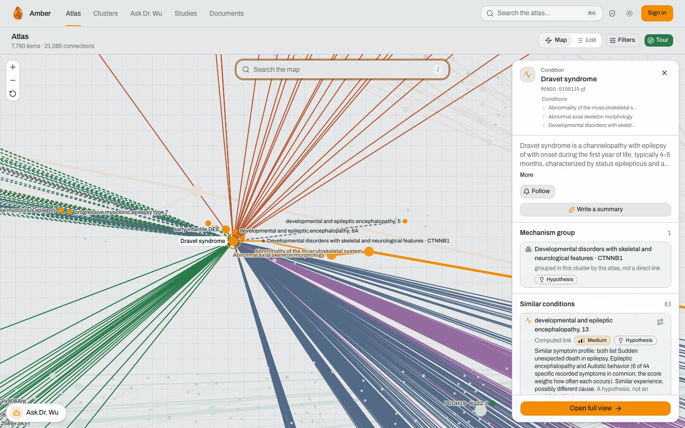
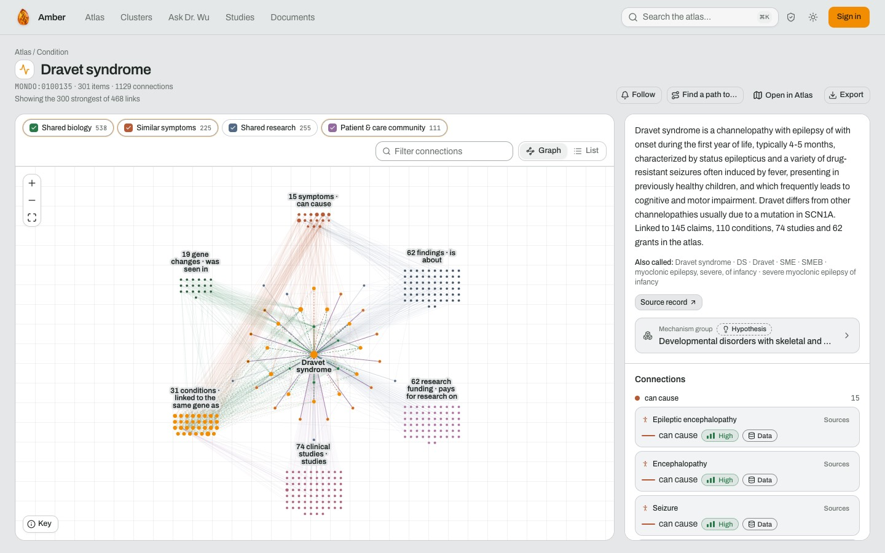
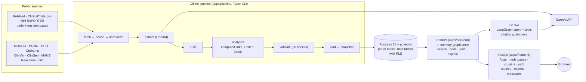

# Amber — an AI atlas for rare diseases

Amber is a sourced knowledge graph of rare diseases with a web app to explore it. It is built for
the people the challenge brief names: patient-group leaders, newly diagnosed families, biotech
scouts and researchers. You type a disease, and Amber shows its mechanism group, related diseases,
genes, symptoms, patient organisations, trials, registries, papers, grants and researchers. Every
connection says where it comes from, how confident it is, and whether it is a cited fact or a
computed hypothesis. A chat agent, Dr. Wu, answers questions over the same graph and cites the
edges it uses.

**Live prototype: <https://frontend-production-aa5a.up.railway.app>** (hosted on Railway). Guests
can use the Atlas map, search, clusters and node pages without signing in. Sign-in there is with
Google and unlocks Dr. Wu, document upload, follows, studies and messaging.

Built for Hack-Nation 7 (2026), Challenge 05 "AI Atlas for the World's Rare Diseases". Specs:
[`docs/specs/system.md`](docs/specs/system.md) (system) and
[`docs/specs/agent.md`](docs/specs/agent.md) (chat agent).



## Contents

1. [A journey through the atlas](#a-journey-through-the-atlas)
2. [How Amber answers the brief](#how-amber-answers-the-brief)
3. [Architecture](#architecture)
4. [Data model](#data-model)
5. [Reproduce the dataset](#reproduce-the-dataset)
6. [Run it locally](#run-it-locally)
7. [Trust, safety and privacy](#trust-safety-and-privacy)
8. [The 10x case](#the-10x-case)
9. [Limits and what is next](#limits-and-what-is-next)
10. [Submission](#submission)

## A journey through the atlas

The example below uses Dravet syndrome. Every item was checked against the loaded data
(`GET /neighborhood/MONDO:0100135` on the API) and on the hosted site, signed out, on 4 October
2026, data version `2026-10-04.24`.

1. **Search.** Type "Dravet" (or "SME", "severe myoclonic epilepsy of infancy") in the global
   search. One search box covers diseases, genes, symptoms, trials, organisations and people, and
   matches synonyms, acronyms and ids. Typing "FOP" finds fibrodysplasia ossificans progressiva
   (`MONDO:0007606`) as an exact synonym match; its card shows its Orphanet (`ORPHA:337`) and OMIM
   (`135100`) ids.
2. **Summary card and drawn connections.** Selecting the disease on the map draws its connections
   and opens a card: the description from MONDO, its mechanism group, and similar conditions. Each
   similar condition is labelled "Computed link", has a confidence level and a one-line reason, for
   example "Similar symptom profile: both list Sudden unexpected death in epilepsy, Epileptic
   encephalopathy and Autistic behavior (6 of 44 specific recorded symptoms in common) … A
   hypothesis, not an established fact."
3. **Mechanism and a related disease.** Dravet syndrome is caused by variants in SCN1A (a cited
   edge, confidence 1.0, 40 evidence rows, 605 pathogenic ClinVar variants). The same gene also
   causes familial hemiplegic migraine type 3, but there the records point to gain of function and
   in Dravet to loss of function. Amber draws this as a dashed `same_gene_different_mechanism`
   link (confidence 0.79): "the same gene may act differently in them". Shared-gene diseases with
   the *same* mechanism, such as generalized epilepsy with febrile seizures plus type 2 (SCN1A,
   loss of function), get a `same_gene_same_mechanism` link instead.
4. **Patient groups.** Ten organisations serve Dravet syndrome in the data, among them the Dravet
   Syndrome Foundation, Dravet Syndrome UK, Dravet Canada, Dravet Italia Onlus, Dravet-Syndrom
   e.V. and Fundación Síndrome de Dravet, each linked to the page it was read from.
5. **Existing trials and registries.** ClinicalTrials.gov studies linked to the disease include
   the ETX101 gene therapy trial in SCN1A-positive Dravet syndrome (`NCT05419492`) and the SCN1A
   Horizons natural history study (`NCT06504511`); registries include ENVISION (`NCT04537832`).
6. **Sources.** The node page lists every connection with its confidence and a "Sources" link to
   the evidence: source database, record id, and for literature the exact quote from the abstract.
7. **What is not known.** The mechanism group is itself labelled "Hypothesis" ("grouped in this
   cluster by the atlas, not a direct link"), and in this data version the group is a poor fit:
   Dravet syndrome sits in "Developmental disorders with skeletal and neurological features ·
   CTNNB1". That is a known clustering weakness (see [Limits](#limits-and-what-is-next)). Dravet
   syndrome has no ORPHA or OMIM id in the data, because Orphanet maps its entry to a MONDO id that
   is out of scope. When two diseases have no route above the confidence threshold, the path view
   says "no supported route" instead of drawing a weak one.





## How Amber answers the brief

### The three modules

| Module | Where it is in Amber | Honest note |
| --- | --- | --- |
| 1. Connect the evidence | The pipeline merges 13 public sources into one graph with standard ids (MONDO, HGNC, HPO, PMID, NCT). Atlas map, node pages, global search. | Papers, trials, grants, people and organisations are collected for the 169 focus diseases only; the other 7,263 diseases have genes, symptoms, pathways and variants. |
| 2. Make each connection trustworthy | Every edge has evidence rows, a confidence score and an `observed` or `inferred` origin. Computed links are dashed and carry a method and a one-line explanation. Path view returns `no_supported_route` when no route clears the threshold. Dr. Wu's answers pass a citation post-check. | Confidence is a tier-weighted formula, not a calibrated probability. |
| 3. Turn the network into action | Mechanistic overlap: `same_gene_same_mechanism` / `same_gene_different_mechanism`, shared pathway, similar symptoms. What can be shared: trials, registries, patient organisations, grants. Network overlap: `shared_researcher` links, researcher and doctor nodes, verified expert cards, studies with sign-ups, messaging. | Candidate links for little-studied diseases (`candidate_phenotype`, `suggested_by_neighbour`) are specified but not produced yet. |

### The four people

| Person | What Amber gives them | Where |
| --- | --- | --- |
| Maria, patient-group leader | Related diseases by mechanism and symptoms, the organisations and registries serving them, researchers shared between diseases. | Node page (Patient and care community, Shared research), Clusters page |
| Devon, newly diagnosed caregiver | Plain-language summary, a patient lens with a reading-grade target of 6, Dr. Wu in patient mode, studies to sign up to, follow a disease and get notifications. | Atlas card, Ask Dr. Wu, Studies |
| Priya, biotech scout | Mechanism groups, same-gene-same-mechanism links across diseases, active trials and grants per disease, export of a subgraph. | Clusters, node page "Export", path view |
| Dr. Osei, researcher | Evidence with quotes and record ids, counterexamples, path finding between two entities, a verified public card that patients can find and message. | Edge evidence sheet, "Find a path to…", People cards |

### The judging criteria

| Criterion | What we built | Partly answered |
| --- | --- | --- |
| Graph quality | Typed nodes and relations ([Data model](#data-model)), Leiden clustering on computed similarity with mechanism conflicts as negative weight, SCN1A and SCN2A counterexamples enforced by validation, path search with a support threshold. | Some clusters are wrong; 77 of 225 hold a single disease. |
| Evidence integrity | Cited facts versus computed hypotheses everywhere (solid versus dashed, "Data" versus "Hypothesis" badges); 1,180 claims extracted from abstracts, each with a quote checked against the source text; model-inferred relations (697) are kept out of the graph; Dr. Wu's citations are checked in code. | Real-model chat answers were tested in a first run only (see Limits). |
| Patient progress | Diagnosis → related diseases and groups → a study sign-up, a message to a verified expert, or a followed disease. | Verification of experts and studies is manual or simulated in the demo. |
| 10x impact | See [The 10x case](#the-10x-case). | An argument with stated assumptions, not a measured result. |
| Ambition and craft | Whole-rare-disease scope (7,432 diseases), a WebGL atlas, a chat agent with tools, consent and privacy built in. | Phone layout has open issues. |

## Architecture



**Ingestion pipeline** (`apps/pipeline`). Ten stages, each a Typer command (`atlas-pipeline
<stage>`) and a Make target. They download public data, resolve names to standard ids, extract
relations from abstracts and patient-organisation pages with a model (keeping the exact quote and
checking it against the source text), merge evidence into edges, compute links and clusters, run
38 validation checks, load Postgres and export a versioned Parquet snapshot. Details in
[Reproduce the dataset](#reproduce-the-dataset).

**Database.** One Postgres 18 database with pgvector. The graph tables (`nodes`, `edges`,
`evidence`, synonyms, clusters) are written only by the pipeline role. Search uses pg_trgm,
unaccent and pgvector with local fastembed embeddings (`BAAI/bge-small-en-v1.5`, no model API).
User tables have `FORCE ROW LEVEL SECURITY`; the API connects as a role that cannot bypass it.

**Backend** (`apps/backend`, FastAPI). Loads all nodes and edges into an in-memory graph store at
startup, so neighbourhood, cluster and path queries never hit the database. Path finding is a
shortest-path search on −log(confidence); a path counts as supported only when every edge clears
the confidence threshold, otherwise the answer is `no_supported_route` with a coverage report.

**Dr. Wu, the chat agent** (`api/services/chat/`). Each turn is a LangGraph graph: safety →
emergency or entities → agent → partial → post-check → persist. The agent has six tools:
`resolve_to_ids`, `search_graph`, `get_neighborhood`, `find_path`, `match_phenotypes` and
`ask_followup`. `match_phenotypes` ranks all diseases by symptom overlap in code, with the same
HPO similarity measure the pipeline uses for `similar_symptoms`; the model does not rank. The post-check runs in code on every turn before
anything is shown: every citation must point at an edge a tool actually returned, origin and
confidence are stated, contradictions and variants of uncertain significance are flagged,
diagnosis wording is blocked, and patient-lens text must pass a reading-grade gate.

**Frontend** (`apps/frontend`, Next.js). Atlas map (WebGL), node pages with a graph and list view,
clusters, path view, Dr. Wu, document upload with a findings review, studies and sign-ups, expert
cards, messaging, follows and notifications, a profile, and an "About the data" page with sources
and licences. It talks to the API with a session cookie and never sees model tokens.

**Sign-in.** Locally the default is Sign in with ChatGPT (OpenID Connect with PKCE against
`auth.openai.com`); model calls then run on the user's own ChatGPT plan. That flow only redirects
to `127.0.0.1`, so the hosted site uses Google sign-in instead, and Dr. Wu runs on the operator's
OpenAI API key. Guests never trigger a model call.

**Where OpenAI models are used, and where not.**

| Used | Not used (code decides) |
| --- | --- |
| **Extract:** relations from PubMed abstracts and patient-organisation pages, each with a verified quote | Confidence scores (tier-weighted formula) |
| **Reconcile:** a decision on leftover names that trigram and embedding matching could not link, logged in `data/logs/linking.jsonl` | Computed links (symptom similarity, shared gene, pathway, mechanism, chromosome proximity, shared researcher) |
| **Explain:** on-demand and precomputed path explanations, summaries | Clustering (Leiden) and the symptom-overlap ranking |
| **Name:** cluster labels and mechanism summaries | Path finding and the "no supported route" decision |
| **Chat:** Dr. Wu's tool calls and answers | The citation post-check |

## Data model

**Node types** (17): disease, gene, variant, phenotype (symptom), pathway, mechanism, cluster,
paper, claim, trial, registry, grant, researcher, doctor, institution, patient organisation and
network.

**Main relations.** Cited: `caused_by_variant_in`, `has_phenotype`, `variant_of`, `observed_in`,
`participates_in`, `acts_via`, `about`, `asserts`, `authored`, `affiliated_with`, `studies`,
`serves`, `runs`, `funds_research_on`, `pi_of`, `investigator_of`, `member_of`. Computed:
`similar_symptoms`, `shared_gene`, `shared_pathway`, `same_gene_same_mechanism`,
`same_gene_different_mechanism`, `near_on_chromosome`, `shared_researcher`.

**Evidence tiers** and their base weights in the confidence formula: curated database 0.9,
peer-reviewed 0.7, review 0.5, preprint 0.4, model-inferred 0.3, patient-reported 0.2,
computed 0.79. Several independent sources raise confidence; contradictions are counted on the
edge.

**Cited facts versus computed hypotheses.** A cited edge comes from a source record or a verified
quote. A computed edge (`origin = inferred`) is always drawn dashed, carries a method, a
one-line explanation and a confidence basis, and is capped below "High" (0.79; 0.45 for
chromosome proximity). Validation fails the build if any computed edge lacks these, exceeds its
cap, or sits on a supported path as a proximity link. Model-written text (summaries, cluster
names, Dr. Wu) is labelled as AI-written in the app.

**Clustering.** Diseases are clustered with Leiden on a weighted graph of computed links: same
gene and same mechanism 1.0, similar symptoms 0.6, shared gene with unknown mechanism 0.5, shared
pathway 0.4, shared researcher 0.15. `shared_gene` and chromosome proximity are left out. A pair
with `same_gene_different_mechanism` gets a negative weight and never pulls together. Clusters
are named by a model from their genes, pathways and symptoms (or by a template without a model).

**Counterexamples.** Two checks in `apps/pipeline/src/pipeline/validate.py`
(`check_counterexamples`, cases in `seeds.yaml`) require that diseases where the same gene acts by
opposite mechanisms end up in different clusters and are joined by a
`same_gene_different_mechanism` edge:

- **SCN2A:** gain of function in developmental and epileptic encephalopathy 11 and in benign
  familial infantile seizures 3 (both cluster 4) versus loss of function in complex
  neurodevelopmental disorder (cluster 84). Passes, with 2 different-mechanism edges.
- **SCN1A:** gain of function in familial hemiplegic migraine 3 (cluster 55) versus loss of
  function in Dravet syndrome (cluster 4). Passes.

**Numbers for data version `2026-10-04.24`** (from `apps/pipeline/data/graph/final/summary.json`
and `GET /stats`):

| | Count |
| --- | --- |
| Nodes / edges / evidence rows | 31,222 / 315,732 / 447,668 |
| Diseases (focus / core) | 7,432 (169 / 7,263) |
| Genes / variants / symptoms / pathways | 5,164 / 681 / 10,415 / 2,016 |
| Papers / claims from abstracts | 904 / 1,180 |
| Trials / registries / grants | 174 / 18 / 193 |
| Researchers / doctors / patient organisations | 1,340 / 159 / 16 |
| Clusters | 225 (77 with a single disease) |
| Cited links / computed links | 231,586 / 84,146 |
| Validation | 38 of 38 checks pass |

The symptom-similarity threshold (0.45) was calibrated against 5,000 random disease pairs: it sits
at the 98th percentile of random similarity.

## Reproduce the dataset

The dataset is defined by `apps/pipeline/seeds.yaml` (which rare diseases qualify, the seed genes
and expansion rules of the focus set, extra focus diseases, golden facts and counterexamples) and
the curated inputs in `apps/pipeline/curated/`. One command runs everything:

```sh
make setup             # once: env file, uv sync, pnpm install
make up && make migrate
make pipeline-login    # optional: ChatGPT login for the model steps (host only, opens a browser)
make pipeline          # = cd apps/pipeline && uv run atlas-pipeline all
make explain           # precompute path explanations
# then restart the API: it loads the graph into memory at startup
```

`make pipeline-docker` runs the same in containers. `atlas-pipeline all` runs these stages in
order; each is also `uv run atlas-pipeline <stage>` or `make -C apps/pipeline <stage>`:

| Step | Command | What it does |
| --- | --- | --- |
| 1 (bulk) | `fetch --phase bulk` | Bulk downloads into `data/raw/<source>/`, each with URL, time, SHA-256 and version |
| 0 | `scope` | Resolves `seeds.yaml` into the qualifying diseases, genes and phenotypes, marked focus or core |
| 1 (scoped) | `fetch --phase scoped` | ClinVar variants, and per focus disease: PubMed, ClinicalTrials.gov, NIH RePORTER, patient-organisation pages |
| 2 | `normalize` | Standard ids, synonyms, linking of leftover names (trigram + embedding, model decision when signed in) |
| 3 | `extract` | Model extraction from abstracts and organisation pages, with quote verification |
| 4 | `build` | Merges evidence into edges with tier-weighted confidence, prunes weakly linked researchers and orphans |
| 5 | `analytics` | Computed links with explanations and capped confidence, Leiden clusters and labels, layouts, centrality |
| 6 | `validate` | 38 checks; the run stops unless all pass |
| 7a | `load` | `psql \copy` into `staging`, then promotes into the graph tables and records the run |
| 7b | `snapshot` | `data/snapshot/<data_version>/`: Parquet files plus `manifest.json` with source versions, hashes, counts, thresholds and quote-verification results |

**Sources** (from the app's "About the data" page):

| Source | What is taken | Licence and attribution |
| --- | --- | --- |
| MONDO | Disease ids, names, synonyms | CC BY 4.0, Monarch Initiative |
| HGNC | Gene symbols and aliases | HGNC terms of use |
| HPO | Symptom terms, disease–symptom links | HPO licence, free with attribution |
| Orphanet | Disease ids and cross-references, gene associations, symptoms, epidemiology | CC BY 4.0, Orphanet / INSERM |
| ClinVar | Variant counts per gene; variants of focus genes | Public domain (NCBI) |
| NCBI MANE | Gene coordinates (GRCh38) | Public data, NCBI and EMBL-EBI |
| ClinGen | Gene–disease validity, dosage sensitivity | ClinGen terms of use |
| Reactome | Gene to pathway mappings | Reactome licence terms |
| Gene Ontology | Gene functions and pathways | CC BY 4.0 |
| PubMed | Abstracts, authors, affiliations | NLM terms; abstracts quoted with a link |
| ClinicalTrials.gov | Studies, status, sites, investigators | Public U.S. government data |
| NIH RePORTER | Grants, PIs, institutions | Public U.S. government data |
| Patient-organisation websites | Name, diseases served, registries and studies, contact page | Summarised as facts with a link |

OMIM numbers come from HPO, MONDO and ClinVar cross-references; OMIM's own files are used only
with an `OMIM_API_KEY` and not for the published atlas.

**Keys and logins.** All optional, in `apps/pipeline/.env` (see
[`apps/pipeline/.env.example`](apps/pipeline/.env.example)): `NCBI_API_KEY` (faster PubMed),
`OMIM_API_KEY`, `BRIGHTDATA_API_KEY` + `BRIGHTDATA_SERP_ZONE` (search for more patient
organisations). The model steps have no team API key: they run on the ChatGPT plan of whoever ran
`make pipeline-login`. `PIPELINE_LLM_MAX_CALLS` (default 300) caps uncached model calls per run
for extraction and cluster labels; `PIPELINE_LLM_DISABLED=true` turns every model call off.
Without a login the run still finishes: extraction uses only cached answers, leftover names stay
unlinked, cluster labels and explanations come from templates.

**Time and caching.** A full run on cached data took about 12 minutes, about 10 of them for the
literature fetches. The first run is longer (the ClinVar download alone takes about 90 seconds,
the first embedding pass about 5 minutes). API responses are cached for 30 days, bulk files are
kept, and every model answer is cached in `data/cache/llm/`, so re-runs make no repeat calls.
`apps/pipeline/data` is about 720 MB.

**What is not reproducible bit for bit.** Model-written parts (extracted relations, linking
decisions, cluster names, explanations) can differ between runs unless the cache is reused.
Upstream sources change between releases; the snapshot manifest records the version and hash of
every file used. Leiden runs with a fixed seed (42).

## Run it locally

**Prerequisites:** Docker with Compose v2; for dev mode [uv](https://docs.astral.sh/uv/)
(Python 3.13), Node.js 22 and pnpm 11 (`corepack enable`); the PostgreSQL client `psql` for the
pipeline outside Docker (set `PSQL_BIN` in `apps/pipeline/.env` if it is not at
`/opt/homebrew/bin/psql`). Run `make help` for all targets.

**Mode 1: database in Docker, API and frontend in dev mode**

```sh
make setup        # apps/backend/.env with generated secrets, uv sync, pnpm install
make up           # Postgres on 5432
make migrate      # Alembic as atlas_owner
make pipeline     # build and load the graph, or: make seed-fixture for a small fixture
make backend      # API on http://127.0.0.1:8000 (separate terminal)
make frontend     # app on http://127.0.0.1:3100 (separate terminal)
```

**Mode 2: everything in Docker**

```sh
make setup             # once, to create apps/backend/.env
make up-all            # builds images, starts db → migrate → api → frontend
make pipeline-docker   # pipeline + explanations in containers, restarts the api
make down-all
```

Open the app at `http://127.0.0.1:3100`, not `localhost`: the ChatGPT sign-in redirects to
`http://127.0.0.1:8000/auth/callback`, and cookies are bound to the host name.

**Tests**

```sh
make test                      # backend (pytest; needs `make up`)
make -C apps/pipeline test     # pipeline unit tests
make -C apps/pipeline lint
make frontend-check            # typecheck, ESLint, Playwright e2e with a mocked API
cd apps/backend && uv run python -m backend.cli eval --mock   # agent evals against the mock
```

A local mock of OpenAI's issuer and API is in
`apps/backend/src/backend/devtools/mock_openai/` (`make mock-openai`), for development only.

**Deployment.** The hosted prototype runs on Railway with two services, backend and frontend;
Railway reads `apps/backend/railway.toml` and `apps/frontend/railway.toml`. Steps, variables and
the Google sign-in setup are in [`docs/deploy-railway.md`](docs/deploy-railway.md).

## Trust, safety and privacy

- **Information, not medical advice.** Amber never gives a diagnosis. A rule-based safety step
  detects emergencies before any model call and answers with an emergency reply; Dr. Wu's
  post-check enforces the medical boundary (no diagnosis wording) and rejects citations to edges
  the tools did not return.
- **Labels everywhere.** Data versus hypothesis, confidence level, and an AI notice on
  model-written text.
- **Privacy.** The rules are in [`docs/compliance.md`](docs/compliance.md) (GDPR and California;
  the stricter rule wins) and [`docs/retention.md`](docs/retention.md). Guests are stateless. One
  general consent (`health_data`) covers chat, profile, uploads and follows; sharing into the
  atlas (`contribute`) and contact with other people (`connect`) each need their own consent.
  Personal data is redacted with Presidio before any model call, raw uploads are deleted after
  extraction, nothing extracted is used until the user confirms it, and every user table is under
  row-level security. The API writes no access log.
- **Simulated in the demo.** Expert verification (ORCID runs in mock mode locally; institutional
  verification is a manual operator step), demo studies seeded by a CLI command, and expert cards
  marked "demo, verification simulated". The hosted site must not take real patients' data
  during the judging week.

## The 10x case

This is an argument with assumptions, not a measured result. The repository contains no team
benchmark of the current timeline.

**Milestone.** A patient group for one rare disease (for example Dravet syndrome) goes from "we
have a diagnosis" to a justified collaboration: it knows which diseases share its mechanism, which
trials, registries and patient groups exist for them, and which researchers work across them, and
it has contacted one of them with a concrete proposal (a shared registry, a joint natural history
study, or a trial referral).

**Today's route (assumed).** A volunteer reads PubMed, ClinicalTrials.gov, Orphanet and
organisation websites disease by disease, works out by hand which genes and mechanisms overlap,
and finds researchers through conferences and personal contacts. We assume this takes weeks to
months of part-time work per disease and misses mechanism-level relatives with different names.

**Route through Amber.** One search gives the disease's cited genes and mechanism, computed
relatives with the reason for each link, the trials, registries and organisations of each, and the
researchers shared between them, all with sources; Dr. Wu answers follow-up questions over the
same graph; a verified expert can be messaged or a study signed up to from the same app. For
Dravet syndrome this is minutes, as the journey above shows.

**Assumptions behind 10x.**

1. The landscape step, not the outreach itself, is the main time cost today.
2. The computed links are good enough to shortlist relatives, which a person then checks against
   the cited sources Amber shows (they are hypotheses, not proof).
3. Researchers and groups are reachable: today only verified experts who opt in can be messaged.
4. The focus-set coverage (papers, trials, people) extends to the disease in question; today it
   covers 169 diseases.

## Limits and what is next

From [`docs/homework.md`](docs/homework.md), the full list of deferred work:

- **Candidate links for little-studied diseases** (`candidate_phenotype`,
  `suggested_by_neighbour`) are specified, capped and validated, but no stage writes them yet;
  they need a "how well studied" measure first.
- **Papers, trials, grants and people** are collected for the 169 focus diseases only.
- **Cluster quality:** some groupings are wrong (FOP sits in a craniofacial and cardiac group,
  Dravet syndrome in a skeletal and neurological one), and 77 of 225 clusters hold one disease.
- **Model-inferred relations** from abstracts (697 of 1,877) are left out of the graph; whether to
  show them as dashed hypotheses is an open decision.
- **Signed-in features** (chat answer quality, document extraction, written explanations, gap
  search, the ORCID round trip) were tested mostly against mocks.
- **Expert verification** is simulated locally (`ORCID_MOCK`); real ORCID credentials are not set
  up yet; institutional verification is manual.
- **Before real users:** a data processing agreement with Railway, an EU region, a DPIA, a record
  of processing, a moderation UI for messages and studies, review of studies before they go live,
  and a legal check on contacting 16- and 17-year-olds.
- **Phone layout:** several small tap targets and map gestures are open; not checked on a real
  device.
- **The API keeps the old graph** until it is restarted after a load.

## Submission

- **Live prototype:** <https://frontend-production-aa5a.up.railway.app>
- **Team video:** link added on submission.
- **One-minute walkthrough:** link added on submission.
- **Source code:** this repository.
- **Team:** _to be filled in by the team._
