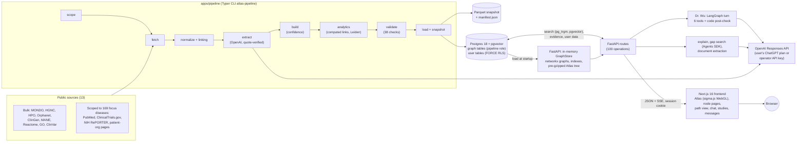
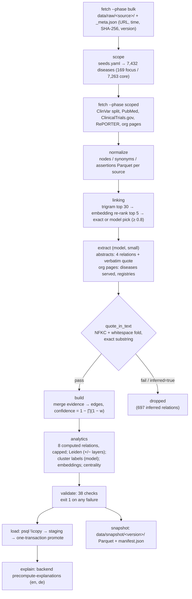
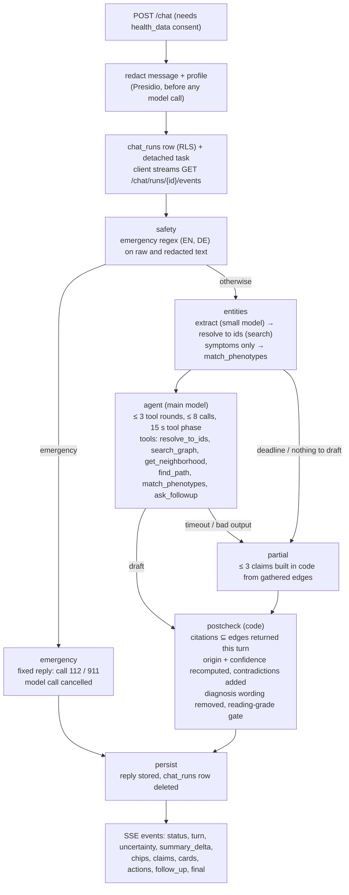

# Amber: Current State of the System

Oct 4, 2026 · as built on `main` at commit `e05ba5c` · data version `2026-10-04.24`

Amber is a sourced knowledge graph of rare diseases with a web app and a chat agent built on it. An offline pipeline merges 13 public sources into 31,222 typed nodes and 315,732 typed edges. Each edge carries evidence rows, a tier-weighted confidence and a cited (`observed`) or computed (`inferred`) origin. A FastAPI backend holds the graph in memory and serves search, neighbourhoods, clusters, path finding and a radial "Atlas" layout. A Next.js frontend draws the Atlas with WebGL. The chat agent, Dr. Wu, is a LangGraph turn over OpenAI models, and code checks every citation before the user sees the answer. Built for Hack-Nation 7, Challenge 05 (OpenAI, Buffalo Initiative).

This document describes what exists, not what was planned. Where the specs (`docs/specs/system.md`, `docs/specs/agent.md`) or the README disagree with the code, the code wins, and the difference is listed in [Appendix A](#appendix-a-discrepancies-between-readmespecs-and-code). [Appendix B](#appendix-b-how-this-document-was-verified) says how each fact was checked. Paths are relative to the repository root. Backend paths are under `apps/backend/src/backend/` unless they are given in full.

## Contents

1. [System at a glance](#1-system-at-a-glance)
2. [The data pipeline as built](#2-the-data-pipeline-as-built)
3. [The graph data model](#3-the-graph-data-model)
4. [Backend and API](#4-backend-and-api)
5. [The chat agent Dr. Wu, and the neighbouring AI features](#5-the-chat-agent-dr-wu-and-the-neighbouring-ai-features)
6. [Frontend](#6-frontend)
7. [Identity, consent and privacy](#7-identity-consent-and-privacy)
8. [Where OpenAI models are used and where code decides](#8-where-openai-models-are-used-and-where-code-decides)
9. [Infrastructure and deployment](#9-infrastructure-and-deployment)
10. [Quality: tests, evals, CI](#10-quality-tests-evals-ci)
11. [Simulated, partial or known-weak](#11-simulated-partial-or-known-weak)
12. [Numbers at a glance](#12-numbers-at-a-glance)
- [Appendix A: discrepancies](#appendix-a-discrepancies-between-readmespecs-and-code)
- [Appendix B: verification](#appendix-b-how-this-document-was-verified)

## 1. System at a glance



| Component | Where | Technology | Role | Status |
| --- | --- | --- | --- | --- |
| Ingestion pipeline | `apps/pipeline/src/pipeline/` | Python 3.13, Typer, polars, networkx, igraph, leidenalg, pyhpo, fastembed, hishel | Downloads sources, resolves ids, extracts relations, builds edges and confidence, computes links and clusters, validates, loads, snapshots | built |
| Dataset definition | `apps/pipeline/seeds.yaml`, `apps/pipeline/curated/` | YAML | Seed genes and diseases, expansion rules, golden facts, counterexamples, 20 curated facts, patient-organisation list | built |
| Database | `apps/backend/migrations/` (14 Alembic revisions), `deploy/compose/initdb/01-bootstrap.sql` | Postgres 18, pgvector, pg_trgm, unaccent | 9 graph tables, 24 user and app tables, 4 roles (`atlas_owner`, `atlas_app`, `atlas_pipeline`, `atlas_definer`) | built |
| Graph store and read API | `api/services/graph.py`, `path.py`, `search.py`, `atlas_tree.py` | FastAPI, networkx, fastembed | In-memory graph; neighbourhood, path, clusters, Atlas layout; hybrid search | built |
| Dr. Wu | `api/services/chat/` | LangGraph `StateGraph`, OpenAI Responses API | Chat turn with tools and a citation and safety post-check | built; real-model quality tested only in a first run (`docs/homework.md`) |
| Explanations | `api/services/explanation/` | OpenAI, textstat | Path and subject summaries with edge-id citations, cached per data version | built; mostly tested against the mock |
| Gap search | `api/services/gap_search/` | OpenAI Agents SDK, PubMed, ClinicalTrials.gov, Bright Data (optional) | Looks for a missing link when no supported route exists; candidates stay pending | built; tested against mocks |
| Document extraction | `api/services/documents/` | PyMuPDF, Tesseract, python-docx, pillow-heif, Presidio, OpenAI Structured Outputs | Upload a report, get grounded findings the user confirms | built; basic OCR |
| Privacy layer | `privacy/redaction.py`, `db/session.py`, migrations | Presidio + spaCy `en_core_web_lg`, Postgres RLS | Redaction before every model call; row-level security on user data | built |
| Sign-in | `openai_auth/`, `google_auth/`, `api/security.py` | OIDC + PKCE (ChatGPT), Google OIDC, HS256 session JWT | Identity; for ChatGPT accounts also the model credential | built; Google tested only against a faked Google |
| Frontend | `apps/frontend/src/` | Next.js 16.3, React 19.2, sigma 3 + graphology, cytoscape, React Flow, shadcn/Tailwind 4 | Atlas, node, path, clusters, chat, documents, profile, studies, messages, people cards | built; phone layout has open issues |
| Studies, messaging, expert cards | `api/services/calls.py`, `messaging/`, `people.py` | FastAPI, Postgres definer functions, Fernet | Calls (studies) with sign-ups, encrypted patient-to-expert messages, verified cards | built; verification simulated or manual |
| Evals | `evals/runner.py`, `evals/golden.yaml` | in-process turn runner | Golden, citation, refusal, readability, redaction checks | built; no recorded results committed |
| Deployment | `deploy/compose/`, `apps/*/Dockerfile`, `apps/*/railway.toml` | Docker Compose, Railway | Local dev and full Docker modes; hosted prototype | built; `deploy/k8s` is a README only |

## 2. The data pipeline as built

The pipeline is the Python package `pipeline` with the Typer CLI `atlas-pipeline` (`apps/pipeline/src/pipeline/cli.py`). Each stage is a command and a target in `apps/pipeline/Makefile`. `atlas-pipeline all` runs every stage in order. The root `make pipeline` calls it.



### Stage order

`all` runs: `fetch --phase bulk` → `scope` → `fetch --phase scoped` → `normalize` (with `linking.run`) → `extract` → `build` → `analytics` → `validate` → `load` → `snapshot` → `explain` (`cli.py:220–237`; `--skip-explain` leaves out the last step). `load` refuses to run unless `validation.json` says `ok: true` for the same `data_version` (`load.require_validated`).

| Stage | Module | Writes | What it does |
| --- | --- | --- | --- |
| fetch (bulk) | `sources/*.py`, `http.py` | `data/raw/<source>/`, `_meta.json` | Downloads bulk files. HTTP goes through a hishel SQLite cache (`data/cache/http/<source>.db`, 30-day TTL), per-source rate limits (PubMed 3/s, 10/s with `NCBI_API_KEY`) and tenacity retries on 408/425/429/5xx |
| scope | `scope.py` | `data/scope/scope.json` | Resolves the 10 seed genes and 13 seed diseases, then expands by breadth-first search over shared gene, shared pathway and HPO similarity (`max_hops` 2) into the **focus** set. It also qualifies the wide **core** set: rare MONDO diseases with an Orphanet/OMIM germline disease-causing association and at most 30 descendants |
| fetch (scoped) | `sources/clinvar.py`, `pubmed.py`, `clinicaltrials.py`, `reporter.py`, `patient_orgs.py` | `data/raw/...` | ClinVar is streamed and split into focus-gene rows, P/LP rows and per-gene counts. Literature, trials, grants and organisation pages are fetched for focus diseases and genes only, with per-term caps (PubMed 40 per seed gene and 20 per seed disease; ClinicalTrials.gov 50/100; RePORTER 100) |
| normalize | `bio.py`, `sources/*` | `data/normalized/<source>/{nodes,synonyms,assertions}.parquet` | Maps to standard ids (MONDO, HGNC, HP, REACT, GO, PMID, NCT) and writes assertions with tier and quote |
| linking | `linking.py` | `data/normalized/linking/`, `data/logs/linking.jsonl` | Orphanet/HPO disease names left without a MONDO mapping get 30 MONDO candidates by trigram Jaccard, re-ranked by the mean of trigram and embedding score (top 5). Trigram ≥ 0.95 is accepted as `exact_label`. Otherwise the model chooses, and its choice is accepted only if it is a candidate with confidence ≥ 0.8. The last log has 5 decisions |
| extract | `extract/abstracts.py`, `extract/patient_orgs.py`, `extract/common.py` | `data/extracted/*/` + `report.json` | Model extraction with verbatim-quote verification (below) |
| build | `build.py` | `data/graph/stage4/` | Merges assertions into edges with evidence rows. Removes duplicate evidence, sorts the endpoints of symmetric relations, computes confidence, prunes researchers with fewer than 2 works (7,698 → 1,340) and drops orphans (7,795) |
| analytics | `analytics.py` | `data/graph/final/*.parquet`, `summary.json` | Computed links, mechanism table, Leiden clusters and lineages, cluster labels, node embeddings (`BAAI/bge-small-en-v1.5`, 384-d, cached by text hash), DrL/ForceAtlas2 positions, PageRank centrality, content-hash version |
| validate | `validate.py` | `data/graph/final/validation.json` | 38 checks (below) |
| load | `load.py` | Postgres | CSV export, `psql \copy` into `staging.*`, then one `PROMOTE` transaction: writes `graph_changes` (what is new per disease, for notifications), clears stale `explanations_cache`, truncates and refills `nodes`, `edges`, `evidence`, `node_synonyms`, `clusters`, `hpo_terms`, upserts `ingestion_runs` |
| snapshot | `snapshot.py` | `data/snapshot/<version>/`, `latest` symlink | Seven Parquet files plus `manifest.json`: `data_version`, `created_at`, `pipeline_commit`, scope, thresholds, counts, `validation_ok`, quote verification, SHA-256 and row count per file, and the version, retrieval time and SHA-256 of every raw source file |
| explain | backend `cli.py precompute-explanations` | `explanations_cache` | Precomputes explanations for up to 12 demo paths in English and German |

### Sources

| Source | What is taken | Module |
| --- | --- | --- |
| MONDO (`mondo.json`) | Disease ids, labels, definitions, synonyms, OMIM/ORPHA/MEDGEN mappings and xrefs (incl. GARD, DOID, NORD as cross-references only), rare subset, germline disease→gene links | `sources/mondo.py`, `bio.mondo_terms` |
| HGNC | Approved gene symbols, names, aliases, previous symbols, locus | `sources/hgnc.py` |
| HPO (`hp.json`, `hp.obo`, `phenotype.hpoa`, `genes_to_phenotype.txt`) | Symptom terms and is_a lineage, disease→symptom links with frequency and onset, excluded (NOT / 0%) symptoms, information content corpus (12,865 diseases) | `sources/hpo.py`, `hpo_sim.py` |
| Orphanet (products 1, 4, 6, 9) | Nomenclature and validated mappings, phenotypes with frequency, gene associations with loss/gain-of-function hints, prevalence | `sources/orphanet.py` |
| ClinGen | Gene–disease validity (Definitive/Strong/Moderate support; Refuted/Disputed contradict); haploinsufficiency score 3 → `acts_via` loss of function | `sources/clingen.py` |
| NCBI MANE v1.5 | GRCh38 coordinates of each gene's MANE Select transcript | `sources/mane.py` |
| ClinVar (`variant_summary.txt.gz`) | P/LP and VUS counts per gene, variant nodes for focus genes (25 per seed gene, 4 otherwise), `observed_in`, `variant_of`, `caused_by_variant_in` when ≥ 2 P/LP variants | `sources/clinvar.py` |
| Reactome | Gene→pathway (`participates_in`), size-capped | `sources/reactome.py` |
| Gene Ontology | Biological-process terms for focus genes (no IEA/ND/NAS, 3–150 genes, at most 5 per gene) | `sources/go.py` |
| PubMed | Abstracts, publication type → tier, authors (researchers), affiliations (institutions), `about` / `authored` / `affiliated_with` | `sources/pubmed.py` |
| ClinicalTrials.gov API v2 | Studies by condition and by gene, officials and site PIs (doctors), sites, registries and natural-history studies; phone numbers and e-mails removed before writing | `sources/clinicaltrials.py` |
| NIH RePORTER v2 | Grants matching an in-scope disease, PIs, institutions | `sources/reporter.py` |
| Patient-organisation pages | Pages of 16 curated organisations (`curated/patient_orgs.yaml`), cleaned with trafilatura; optional Bright Data search discovery | `sources/patient_orgs.py` |

The curated source (`sources/curated.py`, `curated/facts.yaml`) adds 20 hand-checked facts (10 `caused_by_variant_in`, 10 `acts_via`) and the 3 mechanism nodes. The run stops if a curated PMID's title does not match PubMed. OMIM (`genemap2.txt`) is read only with `OMIM_API_KEY`; it was not used for this data version (absent from the manifest's `source_versions`).

### Language models in the pipeline, and how their output is checked

| Step | Schema | Input | Check |
| --- | --- | --- | --- |
| Abstract extraction (`extract/abstracts.py`) | `AbstractExtraction{relations: [ExtractedRelation{subject, relation ∈ caused_by_variant_in / acts_via / participates_in / has_phenotype, object, quote, claim_type, polarity, inferred, confidence}]}` | Abstract plus the list of in-scope entities it mentions. Abstracts without a candidate pair are skipped (328 of 904) | In order: relation in the enum → both entities resolve to the given candidates → endpoint types fit the relation → `quote_in_text`. Relations the model marks `inferred=true` are dropped before any check |
| Patient-organisation pages (`extract/patient_orgs.py`) | `OrgPage{name + quote, diseases_served[{name, quote}], country, runs_registry + quote, runs_natural_history_study + quote, contact_url}` | Cleaned page text, at most 12,000 characters | Every quote passes `quote_in_text`; each served disease must be in scope |
| Linking (`linking.py`) | `LinkDecision{choice, confidence, reason}` | Leftover name and 5 candidates | Choice must be a candidate, confidence ≥ 0.8 |
| Cluster labels (`analytics.py`) | `ClusterLabel{label, mechanism_summary}` | Up to 15 diseases, top genes, pathways, mechanisms, phenotypes of a multi-disease cluster | The lead gene symbol is appended in code (`label · GENE`); labels are made unique. Single-disease clusters get a template label |

**Quote verification** is an exact substring test after normalisation (`extract/common.py:48–59`): Unicode NFKC, typographic quotes, dashes and primes folded to ASCII, soft hyphens and zero-width characters removed, whitespace collapsed. Case is kept. The code comment says "Nothing fuzzier". Result for this data version (`validation.json`, `manifest.json`): 1,202 quotes checked, 1,188 passed, 14 rejected (all `disease_not_in_scope` from organisation pages). Abstracts: 1,180 relations attempted, 1,180 accepted, 697 dropped as inferred. Organisation pages: 22 attempted, 8 accepted.

**Caching and caps.** Every structured answer is cached at `data/cache/llm/<key[:2]>/<key>.json`. The key is the SHA-256 of the model kind, the JSON schema, the instructions and the input (`llm.py:85–171`), so a re-run with the same inputs makes no calls, and cached answers are used even without a sign-in. `PIPELINE_LLM_MAX_CALLS` (default 300) caps uncached calls per run; extraction and cluster labels each get their own budget. Concurrency is 8. `PIPELINE_LLM_DISABLED=true` turns every model call off, and the run then finishes with templates. On `usage_limit_exceeded`, `usage_unavailable` or `reauth_required` the pipeline stops calling but keeps building. The run that built `2026-10-04.24` used `max_calls: 2000`, made 0 new calls and was served entirely from the cache (576 abstract hits). Linking calls the model directly, with no disk cache and no budget (`docs/homework.md`).

**Model and credential.** All pipeline calls use the `small` model kind on the ChatGPT plan of whoever ran `atlas-pipeline login` (`pipeline.llm.get_llm` → `backend.llm.LLMClient` with the CLI token). There is no team API key. Unless `OPENAI_MODEL_SMALL` is set, the slug is picked from the plan's model list (`llm/client.py:212`). The exact model used for the cached answers is not recorded in the outputs and was not verified.

### Validation checks (`validate.py`, 38 in this run, all passing)

- **Structure (12):** every edge has evidence; no orphan nodes; edge endpoints exist; evidence points at edges; unique edge ids; unique node ids; deterministic edge ids (`e_` + SHA-1 of `source|relation|target`); enum values valid; edge family matches relation; confidence within 0..1; inferred edges carry features; every disease has a cluster.
- **Positions and lineage (4):** every gene has coordinates or is listed as missing (5,099 of 5,164 have them); every variant has a position (681 of 681); every phenotype has an `hpo_lineage`; the lineage starts at an organ system and follows is_a.
- **Hypotheses (5):** every inferred edge has a one-line explanation (≤ 400 characters), a method and a confidence basis (84,146 checked); inferred edges stay within their relation's cap; inferred edges are backed by `computed` hypothesis evidence only; no proximity or candidate link can sit on a supported path (all below 0.6); the symptom-similarity threshold is at or above the random-pair 95th percentile.
- **Golden facts (10):** each fact in `seeds.yaml` exists with confidence ≥ 0.6, for example Dravet syndrome `caused_by_variant_in` SCN1A (1.0) and FOP (`MONDO:0007606`) `caused_by_variant_in` ACVR1 (1.0).
- **Counterexamples (2):** for SCN2A and SCN1A, gain-of-function and loss-of-function diseases sit in different clusters and are joined by at least one `same_gene_different_mechanism` edge (detail in §3).
- **Coverage (5):** at least 7,000 diseases with a gene and a symptom (7,415 of 7,432); every disease, gene, phenotype and pathway has `attrs.tier` focus or core; the `hpo_terms` export covers every phenotype; every cluster has a lineage; clusters holding focus diseases start from at most 6 first-level groups (5).

Quote verification is reported in `validation.json` but never fails the build.

### Run time

No stage timings are stored: `cli._timed` prints them to the log only, and neither `summary.json` nor `manifest.json` holds durations. The README says a full run on cached data took about 12 minutes, about 10 of them for literature fetches. That could not be verified from files on disk. On-disk timestamps: bulk files retrieved 2026-10-03 21:48 UTC, scoped files up to 2026-10-04 03:25 UTC, snapshot created 2026-10-04 06:39:46 UTC from pipeline commit `cdce79cd` (no later commit touches `apps/pipeline`). `apps/pipeline/data` is 1.1 GB on this machine.

## 3. The graph data model

### Node types (17)

Counts from `summary.json`: phenotype 10,415 · disease 7,432 · gene 5,164 · pathway 2,016 · researcher 1,340 · institution 1,299 · claim 1,180 · paper 904 · variant 681 · cluster 225 · grant 193 · trial 174 · doctor 159 · registry 18 · patient_org 16 · mechanism 3 · network 3.

Diseases, genes, phenotypes and pathways carry `attrs.tier`. **Focus** means on the Atlas map, with literature, trials, grants and people collected (169 diseases, 126 genes, 806 phenotypes, 665 pathways). **Core** means findable by search and chat, with genes, symptoms and computed links but no literature or people (7,263 diseases).

### Relations (26 defined, 24 produced)

Relations are grouped into four families, which the path finder and the UI filter on (`schemas/enums.py:51–114`).

| Family | Cited (from a source record or a verified quote) | Computed (`origin = inferred`) |
| --- | --- | --- |
| dna | `caused_by_variant_in` 11,346 · `participates_in` 13,836 · `observed_in` 1,517 · `variant_of` 681 · `acts_via` 89 | `shared_pathway` 21,730 · `shared_gene` 10,968 · `near_on_chromosome` 8,436 · `same_gene_same_mechanism` 3,187 · `same_gene_different_mechanism` 237 · `acts_via` 19 |
| symptoms | `has_phenotype` 191,623 | `similar_symptoms` 39,361 · `candidate_phenotype` 0 · `suggested_by_neighbour` 0 |
| research | `authored` 4,052 · `about` 3,387 · `asserts` 1,180 · `funds_research_on` 214 · `pi_of` 104 | `shared_researcher` 208 |
| community | `affiliated_with` 3,080 · `studies` 240 · `investigator_of` 193 · `runs` 19 · `serves` 16 · `member_of` 9 | — |

Totals: 231,586 cited and 84,146 computed edges (live `GET /stats` and `summary.json` agree). All 315,732 edges have status `active`. `candidate_phenotype` and `suggested_by_neighbour` have enums, caps and validation, but no stage produces them. Two further origins, `patient_reported` and `user_contributed`, exist only in the contributions overlay added at runtime (§4).

### Evidence rows and tiers

Every edge has at least one evidence row (`source_type`, `source_id`, URL, quote, tier, polarity, `retrieved_at`). Tier weights (`TIER_WEIGHTS`, `schemas/enums.py:163`):

| Tier | Weight | Rows in this data version |
| --- | --- | --- |
| `curated_db` | 0.9 | 338,657 |
| `peer_reviewed` | 0.7 | 2,869 |
| `review` | 0.5 | 2,890 |
| `preprint` | 0.4 | 8 |
| `llm_inferred` | 0.3 | 8 (organisation pages only) |
| `patient_reported` | 0.2 | 0 (runtime overlay only) |
| `computed` | 0.79 (ceiling; each row weighted by the link's own score) | 103,236 |

Relations extracted by the model from abstracts are stored with the paper's tier (`peer_reviewed`, `review` or `preprint`), not `llm_inferred`, because the quote is verified against the abstract (`abstracts.py:231`). Example: the cited edge Dravet syndrome → SCN1A (`e_da7bfb96736c`) has 40 evidence rows, 4 `curated_db` (one is the ClinGen "Definitive" assertion), 16 `peer_reviewed` and 20 `review` (`GET /edge/e_da7bfb96736c/evidence`).

### Confidence, as implemented

```python
# apps/backend/src/backend/schemas/enums.py:403-423 (shared by pipeline and backend)
CONFIDENCE_THRESHOLD = 0.6
CONTRADICTION_PENALTY = 0.1
def compute_confidence(supporting_weights, n_contradicting):
    remaining = math.prod(1.0 - w for w in supporting_weights)
    value = 1.0 - remaining - CONTRADICTION_PENALTY * n_contradicting
    return round(min(1.0, max(0.0, value)), 6)
```

Display levels: High ≥ 0.8, Medium ≥ 0.5, otherwise Low (`confidence_level`). Independent sources raise confidence (noisy-OR), and each contradicting row subtracts 0.1. For a computed link, `finalize_inferred` (`analytics.py:180–203`) splits the link's score over its k evidence rows as `w = 1 − (1 − score)^(1/k)`, so the merged confidence equals the score. `build.py:246–256` then applies a cap: `INFERRED_CONFIDENCE_CAP = 0.79` (a hypothesis is never "High"), `near_on_chromosome` 0.45, `candidate_phenotype` and `suggested_by_neighbour` 0.55. The capped edge keeps `confidence_raw` and `confidence_cap` in its features. An edge that also has observed evidence becomes observed and loses its hypothesis features. `GET /edge/{id}/evidence` returns a `confidence_breakdown` listing each row's tier and weight.

### Computed links (`analytics.py`)

Every computed edge carries `method`, a one-line `explanation`, a `confidence_basis` and the cap, and validation fails the build if any is missing.

| Relation | How it is produced | Score and cap | Range in this data |
| --- | --- | --- | --- |
| `similar_symptoms` | IC-weighted cosine prefilter (top 25 per disease), then a symmetric, frequency-weighted best-match average over the most informative common HPO ancestor (`backend.phenotype_similarity`). Needs ≥ 3 terms per disease, ≥ 2 shared specific terms (IC ≥ 2.0), similarity ≥ threshold, top 8 per disease | `min(0.30 + 0.55·s, 0.75)` | 0.5475–0.75 |
| `same_gene_same_mechanism` / `same_gene_different_mechanism` | Diseases sharing a causal gene (gene–disease confidence ≥ 0.6), compared on a per-pair mechanism table. Priority: literature > Orphanet hint > ClinGen haploinsufficiency > ClinVar truncating share (≥ 0.4 → loss of function; ≥ 10 variants with ≤ 0.05 truncating → `non_lof`). Genes with more than 25 diseases keep only diseases with a mechanism record | weaker of the two mechanism weights, cap 0.79 | 0.606–0.79 |
| `shared_gene` | Shared causal gene where the mechanism is unknown; genes with more than 25 diseases skipped | `0.85 × min(two gene–disease confidences)`, cap 0.79 | 0.595–0.79 |
| `shared_pathway` | Pathways ≤ 60 genes, diseases ≤ 8 genes, pairs that share a gene skipped; top 5 pairs per disease | noisy-OR of up to 3 pathway weights `0.72/(1+log10 n_genes)`, cap 0.79 | 0.2592–0.79 |
| `near_on_chromosome` | MANE gap ≤ 1 Mb, 3 nearest per gene; cytoband fallback | 0.20, or 0.45 when ≥ 2 P/LP copy-number variants span both genes; cap 0.45 | 0.2–0.45 |
| `shared_researcher` | Authors or grant PIs working on both diseases; people with more than 15 diseases skipped; top 6 per disease | fixed 0.40 | 0.4 |
| `acts_via` (computed) | Focus genes classed loss-of-function by ClinVar | `0.45 + 0.4·strength`, cap 0.79 | 0.619–0.79 (19 edges) |

**Threshold calibration** (`summary.json` `similar_symptoms_calibration`): 5,000 random disease pairs (seed 42) give a median similarity of 0.157, p95 0.396 and p99 0.498. The threshold is `max(0.45, p95)` = 0.45, at the 97.96th percentile of random pairs. 85,141 pairs qualified and the top-8 cap kept 39,361.

Example from the live API (`GET /neighborhood/MONDO:0100135`): `same_gene_different_mechanism` between two GEFS+ subtypes, confidence 0.701, `confidence_basis` "the weaker of the two mechanism records (0.70, 0.85)", with the explanation "Both are linked to variants in SCN1A, but the records point to mainly missense variants (not loss of function) in … type 1 and loss of function in … (ClinVar variant types); the same gene may act differently in them."

### Clustering

Diseases are clustered with Leiden on a two-layer multiplex graph (`cluster_diseases`, `analytics.py:1127–1200`): `leidenalg.RBConfigurationVertexPartition` per layer, `Optimiser.optimise_partition_multiplex([p_pos, p_neg], layer_weights=[1, -1])`, seed 42, resolution 10.0 for the wide set (≥ 1,000 diseases).

- **Positive layer**, weight × the link's cluster score (`CLUSTER_WEIGHTS`): `same_gene_same_mechanism` 1.0, `similar_symptoms` 0.6 (with cluster score 0.9·s), `shared_gene_unknown_mechanism` 0.5, `shared_pathway` 0.4, `shared_researcher` 0.15. `shared_gene` and `near_on_chromosome` are excluded.
- **Negative layer:** `same_gene_different_mechanism`, weight 2.0 × score. The pair also loses any positive weight ("a different-mechanism pair never pulls together").
- **Hard post-fix:** if a negative pair still shares a cluster, the disease with fewer positive ties moves to the allowed cluster it is most tied to, or to a new one.
- **Labels:** model-written for 148 clusters, template for 77. Each cluster also gets an HPO lineage (organ system → anchor term) that the Atlas Diseases trunk uses.
- **Counterexample checks** (`validate.check_counterexamples`, cases in `seeds.yaml`), passing in this run:
  - SCN2A: gain-of-function DEE 11 and benign familial infantile seizures 3 are in `CLUSTER:4`; the loss-of-function disease is in `CLUSTER:84`; 2 different-mechanism edges.
  - SCN1A: familial hemiplegic migraine 3 is in `CLUSTER:55`; Dravet syndrome is in `CLUSTER:4`.

Result: 225 clusters, 77 holding a single disease, largest 185, 24 containing focus diseases (`GET /clusters`). Some groupings are wrong: Dravet syndrome sits in "Developmental disorders with skeletal and neurological features · CTNNB1" (131 members), and FOP in "Developmental disorders with craniofacial and cardiac abnormalities · CCDC22".

### Path finding (`api/services/path.py`)

- **Search:** `GET /path?from&to&family&k&include_vus` runs Yen's k-shortest simple paths (`nx.shortest_simple_paths`) on an undirected per-family graph (`dna`, `symptoms`, `research`, `all`), built at startup from active edges.
- **Edges and cost:** for each node pair, the cheapest edge that meets the threshold is used. The edge cost is `−log(max(confidence, 1e-9))` (`graph.edge_cost`).
- **Ranking:** paths are ranked by cost plus a hub penalty `0.4·log(degree)` on phenotype, mechanism and pathway intermediates. Generic hubs (degree ≥ max(10, p95)) and VUS variants (unless `include_vus`) cannot be intermediates.
- **Support threshold:** a path is `supported` only when every edge has confidence ≥ 0.6 (`CONFIDENCE_THRESHOLD`) and is active.
- **`no_supported_route`:** if no route clears the threshold, the response has `status: "no_supported_route"`, no paths, and a `CoverageReport`: evidence counts per source queried, the closest partial path from a relaxed search, a `missing_link` description and a `suggested_question`. The frontend offers gap search from there.
- **Live example:** `GET /path?from=MONDO:0100135&to=MONDO:0007606&family=research` gives `no_supported_route`: "From Dravet syndrome the atlas reaches 3791 other node(s); from fibrodysplasia ossificans progressiva it reaches 37; the two parts do not meet." With `family=all` the same pair has 3 supported paths.
- **No hop limit:** there is no cap on path length. Because cited edges near 1.0 cost almost nothing, the best Dravet→FOP route in `family=all` is 16 edges long (14 `caused_by_variant_in` hops through genes and diseases, then 2 `has_phenotype`), `total_cost` 0.151. See §11.

## 4. Backend and API

### How the graph is served

At startup (`main.py` lifespan → `load_graph_on_startup` → `graph.load_graph`, `graph.py:248`) the API reads `nodes`, `edges`, per-edge evidence aggregates, synonyms, clusters, the latest `ingestion_runs` row, `hpo_terms`, open edge-flag counts and the shared-contributions overlay into a `GraphStore` (`graph.py:105`). The store holds an `nx.MultiDiGraph`, one undirected path graph per family, incident and member indexes, degree and hub degree, name and id indexes, per-edge source counts and a phenotype index. It then pre-builds the gzipped Atlas tree, warms the embedding model in a thread and calls `gc.freeze()`. `/health` answers only after this, so Railway's 300 s health check waits for the graph. A new pipeline load needs an API restart (`docs/homework.md`).

| Served from memory | Served from Postgres |
| --- | --- |
| `/node`, `/neighborhood` (max 300 neighbours, truncation in `X-Neighborhood-*` headers), `/clusters`, `/atlas/tree.json`, `/atlas.json`, `/atlas/summary/{id}`, `/stats`, `/path`, `/export/graph` | `/search` (trigram and vector parts), `/edge/{id}/evidence`, the explanation cache, gap-search term lookup, every user table and every write |

### Search (`api/services/search.py`)

One endpoint, `GET /search?q&types&limit&expert`, searches across node types in tiers:

1. **Exact, in memory:** id (score 3.0; CURIEs normalised, e.g. MONDO numbers padded), name (2.5, genes +0.2), synonym (2.2). The name index covers labels, symbols, synonyms and ORPHA/OMIM ids.
2. **Phrase, in memory:** 1.2 + 0.5 × coverage.
3. **Trigram, Postgres:** `greatest(similarity(), word_similarity())` on `f_unaccent(lower(...))` over `node_synonyms.synonym` and `nodes.label`, with GIN trigram indexes; base `0.5 + sim`.
4. **Vector, Postgres:** the query is embedded locally with fastembed `BAAI/bge-small-en-v1.5` (384-d, no model API), then a pgvector cosine search over `nodes.embedding` (HNSW index), top 30. A hit is kept if sim ≥ 0.58 and within 0.08 of the best hit; base `(sim − 0.5)·2.5`. A 5 s timeout falls back to lexical search.
5. **Fusion:** `base + TYPE_BOOST[type] + 0.15·centrality + 0.1` if both lexical and vector matched (`TYPE_BOOST`: disease 0.15, gene 0.12, phenotype 0.10, …). Expert mode also ranks clusters.

Live check: `GET /search?q=FOP` returns fibrodysplasia ossificans progressiva first (`match_kind: "exact"`, `matched_synonym: "FOP"`, score 2.47). `q=severe myoclonic epilepsy` returns Dravet syndrome first through the synonym "myoclonic epilepsy, severe, of infancy".

### Route inventory

The live `GET /openapi.json` and the committed `apps/backend/openapi.json` list the same 100 operations.

| Area | Routes | Access |
| --- | --- | --- |
| Health, session | `GET /health`, `GET /stats`, `GET /auth/session` | anyone |
| Graph read | `GET /search`, `/node/{id}`, `/neighborhood/{id}`, `/clusters`, `/edge/{id}/evidence`, `/path`, `/export/graph` (CSV/GraphML, depth 1–3), `/atlas/tree.json` (ETag, pre-gzipped), `/atlas/summary/{id}`, `/atlas.json` (legacy, unused by the frontend) | anyone |
| Sign-in | `GET /auth/chatgpt/start`, `/auth/chatgpt/callback`, `/auth/callback`, `/auth/google/start`, `/auth/google/callback`, `POST /auth/logout` | anyone |
| Explanations | `POST /explain` (SSE) | anyone for cached text; generating new text needs sign-in |
| Dr. Wu | `POST /chat` (SSE), `GET /chat/runs`, `GET /chat/runs/{id}/events` (SSE), `DELETE /chat/runs/{id}`, `GET/DELETE /chat/sessions[/{id}]` | `POST /chat` needs `health_data` consent |
| Gap search | `POST /gap-search` (SSE) | signed in |
| Documents | `POST /documents` (202, background job), `GET /documents`, `DELETE /documents/{id}`, `GET /documents/{id}/findings`, `GET /jobs/{id}` (SSE), `POST /findings/{id}/confirm|reject` | `health_data` |
| Contributions, flags, proposal | `GET/POST /contributions`, `DELETE /contributions/{id}`, `POST /edges/{id}/flag`, `POST /proposal` (deterministic HTML) | signed in; `POST /contributions` needs `contribute` |
| Account and rights | `GET/PUT /profile`, `PATCH /me/settings`, `GET /me/export`, `DELETE /me`, `GET/POST /consents`, `DELETE /consents/{type}` | signed in |
| Follows, notifications | `GET/PUT/DELETE /me/follows`, `POST /me/follows/from-profile`, `GET /notifications`, `/notifications/unread-count`, `POST /notifications/read` | signed in; following needs `health_data` |
| Professionals and cards | `GET/PUT/DELETE /me/professional`, `POST /me/professional/matches`, `GET/PUT /me/professional/card`, ORCID start/callback, verification request, `GET /people`, `/people/{card_id}` | signed in |
| Messaging | 16 routes under `/me/threads`, `/me/blocks`, `/me/connect` | signed in; writing needs `connect` |
| Calls (studies) and sign-ups | `GET /calls`, `/calls/{id}`, `/calls/suggested`, `GET/POST /calls/{id}/signup`, `GET /me/signups`, `DELETE /me/signups/{id}`, and 10 routes under `/me/calls` | signed in |

Most signed-in routes also require the 16+ confirmation (403 `age_confirmation_required`). Five routes stream Server-Sent Events (`api/sse.py`). Each frame is `event: <type>` + `data: <json>`, and the SSE `id` is the run's sequence number, so a client can re-attach to a chat run with `?after=N`.

### Rate limits

`api/ratelimit.py`, in memory and per process; every 429 is `rate_limited` in the error envelope with `reason` (`rate`, `busy`, `budget`), `retry_after` and a `Retry-After` header. The client is the account when signed in; a guest is a keyed hash of the client address plus User-Agent (and the address alone at 4× the limits), the address taken from `X-Forwarded-For` only as far as `TRUSTED_PROXY_HOPS` allows (1 on Railway). Layers: every request 600/minute per client (`RATE_LIMIT_GENERAL`, an app-wide dependency), expensive reads (`READ_LIMITS`: search 120/minute, neighbourhood 60, path 30, clusters 30, Atlas tree 30, Atlas summary 120 per minute, `atlas.json` 10/minute, graph export 30/hour); slowapi decorators per route (`POST /chat` 30/minute and 300/day; `POST /gap-search` 20/hour; `POST /documents` 10/hour; `POST /contributions` and edge flags 30/hour; `POST /me/threads` 20/hour plus 5 new conversations a day in the database; messages 120/hour; call sign-ups 20/day); and for model-calling requests (`admit_model_request`): new explanations 20/minute and 200/day per account, at most 3 runs at once per account and 16 per process ("busy"), and for accounts on the operator's key `MODEL_DAILY_BUDGET` (200) per account and `MODEL_DAILY_CEILING` (2000) per process and UTC day.

## 5. The chat agent Dr. Wu, and the neighbouring AI features

### One turn



**Orchestration.** A turn is a LangGraph `StateGraph` built in `build_turn_graph` (`api/services/chat/agent.py:552–577`) with the nodes `safety`, `emergency`, `entities`, `agent`, `partial`, `postcheck`, `persist`. Conditional edges: `safety` → `emergency` or `entities`; `entities` → `agent` or `partial`; `agent` → `postcheck`, or `partial` if there is no draft; `partial` → `postcheck`. The turn runs detached from the HTTP request (`chat/runs.py`). The client attaches by run id and replays numbered events. The state is checkpointed per node by a custom saver (`ChatRunSaver`, `checkpoints.py`) into the run's own `chat_runs` row, which is under row-level security, holds redacted text only and is deleted when the turn ends. A run whose process died is stored as an interrupted failed turn and is not resumed.

**Budgets** (`agent.py:54–59`): `MAX_TOOL_ROUNDS = 3`, `MAX_TOOL_CALLS = 8`, `TOOL_PHASE_S = 15.0`, `TURN_DEADLINE_S = 90.0`, last 8 history messages. When a budget is spent the client adds a "final now" note and sets `tool_choice: "none"` (`llm/client.py:864`). A final answer that fails schema validation is retried up to 2 times. On a timeout or bad output, the turn answers from what its tools gathered (`partial`), and fails only if nothing was gathered.

**Tools** (`chat/tools.py`, `build_tools`). The model gets six tools in an `amber` namespace, with fallbacks to plain functions and then a JSON text protocol if the upstream rejects namespaces. A seventh step, `extract_entities`, runs in code before the first round.

| Tool | Does |
| --- | --- |
| `resolve_to_ids` | Maps mentions to graph ids through the search service (top 3 per mention, at most 20 mentions); results become unconfirmed chips |
| `search_graph` | Search with optional types and expert cluster ranking |
| `get_neighborhood` | Node neighbourhood for the user's lens, at most 60 edges, sorted by relation priority |
| `find_path` | The path service (k = 3); on `no_supported_route` it returns the coverage report |
| `match_phenotypes` | Ranks all diseases by symptom overlap in code, with the same HPO similarity the pipeline uses for `similar_symptoms`; top 10, present and absent symptoms. The model does not rank |
| `ask_followup` | Picks the phenotype that splits candidate clusters most evenly; at most one per turn |

**Post-check** (`chat/postcheck.py`, `check_reply`, runs in code on every turn before anything is sent):

1. **Citations:** a claim is removed whole if it has no edge ids or cites any edge id the tools did not return this turn. There is no regeneration; the count goes to the report.
2. **Origin and confidence:** recomputed from the cited edges (the weakest origin wins, confidence is the minimum). A claim on a non-active edge gets "(under review)".
3. **Contradictions:** a contradiction is added for every cited edge that has contradicting evidence. The model's own contradiction entries are kept only if they point at kept claims.
4. **Actions:** kept only if their edge ids are known. They are `viable` only if every edge is observed, active and uncontradicted.
5. **Cards and map focus:** limited to ids returned this turn. If the model gave none, the best supported path fills in.
6. **Follow-up:** dropped unless `ask_followup` ran.
7. **Medical boundary:** sentences, claims and actions matching the diagnosis/prognosis regexes (`safety.STATED`) are removed, and a fixed decline sentence is added.
8. **Summary and notices:** at most 3 summary sentences. Fixed sentences are added for no route, symptoms-only input (see a geneticist) and VUS.
9. **Uncertainty:** a fixed uncertainty line when every path or claim is below 0.6.

**Emergency handling** (`chat/safety.py`): one case-insensitive regex for English and German covers breathing problems, turning blue, unconsciousness, an ongoing seizure, suicide or self-harm, overdose or poisoning, and chest pain. It runs on both the raw and the redacted message. On a match the model task is cancelled, and the graph goes `safety → emergency → persist` with a fixed reply ("This sounds like an emergency. Please call your local emergency number now (112 in Europe, 911 in the US). Dr. Wu is an AI and cannot help in an emergency."). No classifier is used; other languages are not covered.

**Reading-level gate** (`postcheck.py:573–607`, `explanation/common.py`): `textstat.flesch_kincaid_grade` for English, Wiener Sachtextformel for German (+2 allowance). Targets by role: guest 6, patient 8, doctor 12, researcher 14. Only guest and patient replies are gated. A reply over target gets up to 2 rewrites by the small model; the lowest-grade version is kept, and the reply is sent even if it still fails.

**Lenses.** Roles are `guest`, `patient`, `doctor`, `researcher` (there is no caregiver role; caregivers use `patient`). The role sets the start instruction, the grade target and expert mode (on by default for researchers). It changes wording and starting point, not the facts returned.

**Streaming.** The final answer is not streamed token by token. After the post-check, the checked summary is cut into 4-word chunks (`chunk_text`) and sent as `summary_delta` events. The frontend reveals them word by word (`smooth-reveal.tsx`, 28 words/s).

**Model and provider.** OpenAI only, through the Responses API with `store=False, stream=True` (`llm/client.py`). There is no local LLM; only embeddings run locally. Credentials depend on how the user signed in (`api/services/auth.py:446 llm_for_user`):

| Sign-in | Credential | Models |
| --- | --- | --- |
| Sign in with ChatGPT (local) | The user's own OAuth token, Fernet-encrypted in `openai_tokens`, billed to their ChatGPT plan | `OPENAI_MODEL_MAIN` / `OPENAI_MODEL_SMALL`, else picked by slug from the plan's `/models` list (cached 6 h) |
| Google (hosted) | Operator key `OPENAI_API_KEY`; without it Dr. Wu answers 503 | `OPENAI_API_MODEL_MAIN` (default `gpt-5`), `OPENAI_API_MODEL_SMALL` (default `gpt-5-mini`) |

The agent uses the main model, with `low` reasoning effort for tool rounds. Extraction and the reading-gate rewrite use the small model. No temperature is set. `docs/homework.md` records that on the developer's ChatGPT plan `small` resolved to the main model; this was not re-verified.

### Neighbouring AI features

| Feature | Where | Model use | Checks in code |
| --- | --- | --- | --- |
| Explanations and summaries (`POST /explain`) | `api/services/explanation/` | Main model writes a role-styled text over a path's or subject's edges | Every sentence must end with edge ids from that path; `enforce_trust_rules` adds missing hedges, contradictions, review status and the VUS notice; reading-grade gate; up to 3 attempts. Cached in `explanations_cache` by (path id, role, language, data version) and replayed to guests. `precompute-explanations` fills it for 12 demo paths, using templates without a login |
| Gap search (`POST /gap-search`) | `api/services/gap_search/` | OpenAI Agents SDK (fallback: the same gateway tool loop), main model, tools `pubmed_search`, `clinicaltrials_search`, `fetch_page` (SSRF-guarded), `web_search` (Bright Data, optional) | Input is public graph terms only (ids, labels, ≤ 8 synonyms). Budgets: 8 tool calls, 11 turns, 150k tokens, 90 s, 5 candidates. `verify()` keeps a candidate only if its 20–1,000-character quote occurs in the fetched source and names both nodes. Candidates are always `origin=inferred`, `status=pending_review`, stored on a `jobs` row, never in the graph |
| Proposal export (`POST /proposal`) | `api/services/proposal.py` | none | Deterministic, HTML-escaped document from graph data |
| Document extraction (`POST /documents`) | `api/services/documents/` | Small model classifies (genetic report, clinical letter, research paper, registry document) and extracts with Structured Outputs | Text from PyMuPDF, Tesseract OCR (300 DPI), python-docx or pillow-heif; Presidio redaction per page before the model; each finding's snippet must appear on its stated page, and genes, HGVS and dates are re-checked against the page; at most 60 findings; nothing is used until the user confirms it. Raw bytes stay in memory and are dropped in `finally`. Limits: 20 MB, 30 pages, 600 s |

## 6. Frontend

Next.js 16.3.8 with React 19.2.8 and TypeScript (`apps/frontend`). The API client is generated from `apps/backend/openapi.json` with `@hey-api/openapi-ts`, and SSE uses a hand-written client (`src/lib/api/sse.ts`). The UI uses shadcn on Base UI with Tailwind 4. State lives in React context only (session, lens, gate providers).

### Routes (`src/app`)

| Route | Shows | Access |
| --- | --- | --- |
| `/` | Landing: input, demo journey, sections on the graph, connecting and preparing | public |
| `/atlas` | The Atlas map, with `?focus=`, `?tour=1`, `?path=<edge ids>` | public |
| `/node/[id]` | Node page: neighbourhood graph (cytoscape + fcose) and list, grouped connections, evidence sheet, export | public; actions need sign-in |
| `/path` | Route between two nodes (React Flow), steps, explanation, `no_supported_route` with gap search | public; explain and gap search need sign-in |
| `/clusters` | Mechanism clusters, labelled as hypotheses | public |
| `/chat` | Dr. Wu (guests see a sign-in pitch) | sign-in |
| `/documents`, `/documents/[id]` | Upload, findings review | sign-in |
| `/profile`, `/welcome` | Profile, settings, consents, export, delete; onboarding (role, age, privacy) | sign-in |
| `/calls`, `/calls/[id]`, `/calls/mine/*`, `/calls/signups` | Studies, publishing (verified professionals), sign-ups (patients) | sign-in |
| `/messages`, `/messages/[id]` | Patient-to-expert conversations | sign-in |
| `/people/[card_id]` | Verified expert card | sign-in |
| `/guide`, `/about-data`, `/privacy` | Feature guide, sources and licences, privacy notice | public |

### The Atlas map

- **Renderer:** sigma.js 3 (WebGL) over a graphology `MultiGraph` in `src/components/atlas/atlas-canvas.tsx`, loaded client-side only.
- **Custom WebGL programs:**
  - `EdgeDashProgram` (`edge-dash-program.ts`) extends sigma's rectangle edge program with a per-edge `a_dash` attribute and a screen-pixel `v_along` varying. The fragment shader discards fragments to draw dashed (6 px on, 4 px off) and dotted (2 on, 3 off) lines. The picking pass is never dashed, so gaps stay clickable.
  - `NodeMinCircleProgram` (`node-min-program.ts`, commit `d629ae2`) adds a floor on the on-screen dot radius. The floor fades in once the camera zooms in past ratio 0.7 and reaches 5.5 px (`NODE_MIN_RADIUS_PX`) at ratio 0.03, so leaf dots stay clickable. Above the 0.7 knee, drawn sizes scale with `sqrt(ratio)`; below it they shrink much more slowly (`zoomToSizeRatio`, `atlas-model.ts`), so lines stay thin.
- **Layout source:** positions are not computed in the browser. The backend builds a deterministic radial tree in `api/services/atlas_tree.py` (`LAYOUT_VERSION = 6`) and serves it as `GET /atlas/tree.json` (7.6 MB raw, about 770 KB gzipped, ETag).
  - Structure: a logo hub (`T:root`), 9 category trunks (Researchers, Hospitals & universities, Literature, Community, Pathways, Genes, Diseases, Symptoms, Doctors), 932 group nodes and 7,760 entity leaves, plus 21,085 real edges among them (19,411 observed, 1,674 inferred).
  - Placement: each category owns an angular sector. Each node gets a wedge of its parent's wedge by subtree size and is placed only where it touches nothing placed before, so crowded branches grow longer instead of overlapping. Jitter is hashed from ids.
  - The Diseases trunk follows the cluster lineages.
  - The pipeline's DrL/ForceAtlas2 positions (`nodes.x`, `nodes.y`) are not used by the map. They feed the legacy `/atlas.json`.
- **On-map and off-map:** only focus nodes are on the map. Core nodes are found through search and Dr. Wu and open in the panel with a "Not on the map yet" mark (`atlas-offmap.tsx`), public id links (MONDO, ORPHA, OMIM, HGNC, HP) and a coverage line saying literature and people are collected for the focus diseases only.
- **Interaction:**
  - Selecting an entity adds its real edges on demand (`syncRealEdges`) and dims everything else. Emphasis cross-fades over 220 ms (immediate under reduced motion).
  - Labels are drawn on a 2D overlay canvas with grid-hash collision avoidance (at most 320 labels), and category names are rotated HTML labels.
  - Dr. Wu's finds are ringed on the map, and its `highlight_path` is drawn as a chain (`atlas-wu-path.ts`).
  - Keyboard: arrows, `+`/`-`, `0`, Esc.
- **No hulls:** grouping is the tree itself, coloured per category. Mechanism clusters are a list on `/clusters`.

### Lenses by role

The lens comes from the user's role (guests get `guest`). It "changes words, never what is shown" (`src/lib/graph/meta.ts`).

| Role | Atlas start | Label style |
| --- | --- | --- |
| guest | whole map | plain wording |
| patient | Diseases | plain wording ("Conditions") |
| doctor | Symptoms | clinical ("Features") |
| researcher | Diseases | technical, ids shown ("Phenotypes"), Dr. Wu expert mode on |

### How link origin is drawn

From `ORIGIN_META` in `src/lib/graph/meta.ts`, with the same rules in all three renderers (sigma WebGL, cytoscape canvas, React Flow DOM):

| Origin | Badge | Line |
| --- | --- | --- |
| `observed` | "Data" | solid |
| `inferred` (computed) | "Hypothesis" | dashed (6/4) |
| `patient_reported` | — | dotted |
| `user_contributed` | "pending review" | dotted |

Colour is by edge family (CSS tokens `--edge-dna`, `--edge-symptoms`, `--edge-research`, `--edge-community`). Flagged edges use `--status-flag`. On the node and path views, width and opacity follow the confidence level (high 2.25 px / 0.95, medium 1.5 / 0.75, low 1 / 0.5). On the Atlas, real edges are 1.1 and chain edges 3. Model-written text carries an AI notice.

## 7. Identity, consent and privacy

| Topic | As built |
| --- | --- |
| Sign-in | Two modes: Sign in with ChatGPT (OIDC + PKCE against `auth.openai.com`, `openai_auth/oidc.py`, scope includes `offline_access` and `chatgpt.tokens.use.direct`, loopback redirect only, so local only) and Google (`google_auth/`, scope `openid email profile`, ID token verified, Google tokens discarded; offered only when `GOOGLE_CLIENT_*` and `OPENAI_API_KEY` or `GOOGLE_LOGIN_ENABLED` are set). This local API reports `"sign_in_methods":["openai"]` (`GET /auth/session`). ORCID is used for professional verification, not sign-in |
| Session | Cookie `amber_session`: HS256 JWT, HttpOnly, SameSite=Lax, `Secure` per `COOKIE_SECURE`, 60-minute TTL with sliding re-issue. The API refuses a non-loopback start with the development secret, `COOKIE_SECURE=false` or `ORCID_MOCK` |
| Consents | Three types (`schemas/enums.py:201`), each pinned to a text version: `health_data` (one general Art. 9 consent for chat, profile, uploads, findings, follows), `contribute` (sharing into the atlas), `connect` (messaging, call suggestions, sign-ups). Enforced by `require_consent`. Withdrawal deletes the data held under that consent (`docs/retention.md`) |
| Redaction | Presidio `AnalyzerEngine` with spaCy `en_core_web_lg`, plus custom recognisers (labelled names and dates of birth, patient/MRN/insurance ids, EN/DE/EU/NL addresses, phones). Gene symbols, HGVS, ontology ids, disease eponyms, countries and "Dr. Wu" are protected. It runs on chat messages, the profile, document pages and contribution text before any model call. Stored chat text is the redacted text |
| Row-level security | Every user table has `ENABLE` and `FORCE ROW LEVEL SECURITY`. Each transaction sets `app.user_id` with `set_config(..., true)` (`db/session.py`), and policies compare the owner column with it. The API connects as `atlas_app` (`NOBYPASSRLS`). Graph tables are written only by `atlas_pipeline`. Shared rows are reached only through `SECURITY DEFINER` functions owned by the non-login `atlas_definer` (e.g. `shared_contributions()`, `professional_cards()`, `publish_own_call()`) |
| Retention | `docs/retention.md` is the table. Raw uploads live in process memory only; running chat turns are deleted when they end; notifications 90 days; inactive conversations 12 months; reports 12 months; operator access log 24 months. Purges run lazily on read and through `backend.cli purge-messages`; no scheduler is deployed. uvicorn's access log is off (`access_log=False`); the API writes its own key=value request lines with route templates only (`api/request_log.py`, `observability/logs.py`) |
| Messaging | Bodies encrypted with `MESSAGE_ENCRYPTION_KEY` (Fernet), never sent to a model; patients write first; 5 new conversations a day |
| Guests | Stateless: no user rows, no cookies beyond sign-in state. They can use the Atlas, search, node pages, clusters, path, evidence, export and cached explanations. They never trigger a model call |

## 8. Where OpenAI models are used and where code decides

| OpenAI model used for | Deterministic code decides |
| --- | --- |
| Pipeline: extracting relations from 576 PubMed abstracts and organisation pages (small model, Structured Outputs) | Whether a quote is verbatim in the source (`quote_in_text`), and dropping model-marked inferred relations |
| Pipeline: picking a MONDO match for leftover names | The candidate list (trigram + local embeddings) and the 0.8 acceptance bar |
| Pipeline: cluster names and mechanism summaries (148 clusters) | Cluster membership (Leiden), the lead gene in the label, template labels for single-disease clusters |
| — | Every confidence score (tier-weighted noisy-OR, caps) |
| — | All 84,146 computed links and their explanations (templated text from the data) |
| — | Path finding, the 0.6 support threshold and `no_supported_route` |
| — | Search ranking (local `bge-small` embeddings, trigram, fusion) |
| Dr. Wu: entity extraction (small), tool calls and the draft answer (main) | Symptom-overlap ranking (`match_phenotypes`), the follow-up choice, emergency detection, the citation and safety post-check, the reading-grade measure, partial answers |
| Dr. Wu and explanations: simplifying text above the reading target (small) | Whether the grade passes and which version ships |
| Explanations and summaries (main) | Citation subset check, trust-rule insertion, caching per data version |
| Gap search agent (main, Agents SDK) | Query terms (public ids and labels only), quote verification of candidates, pending-review status |
| Document classification and extraction (small) | File type detection, OCR, redaction, page-grounding of every finding, user confirmation |
| — | Proposal export, graph export, calls wording check (regex), call suggestions |

## 9. Infrastructure and deployment

| Mode | How | What runs |
| --- | --- | --- |
| Dev (default) | `make setup`, `make up`, `make migrate`, `make pipeline` (or `make seed-fixture`), `make backend`, `make frontend` | Postgres in Docker (`pgvector/pgvector:pg18`), API on `127.0.0.1:8000` (uvicorn with reload), frontend on `127.0.0.1:3100` |
| All in Docker | `make up-all`, `make pipeline-docker`, `make down-all` (`deploy/compose/docker-compose.yml`, profiles `app` and `pipeline`) | `db` → `migrate` (Alembic as `atlas_owner`) → `api` → `frontend`; `pipeline` and `explain` on demand, sharing the host's ChatGPT login and a fastembed cache volume |
| Hosted (Railway) | `docs/deploy-railway.md`, `apps/backend/railway.toml`, `apps/frontend/railway.toml` | Services `frontend`, `backend`, `Postgres` (`postgres-ssl:18`). The backend runs `alembic upgrade head` before deploy, then uvicorn without an access log; health check `/health`, 300 s. The browser talks only to the frontend, which proxies `/api/*` and `/auth/*` to the backend over the private network (`API_PROXY_TARGET`), so cookies stay first-party. Data is loaded from a developer machine through a temporary TCP proxy. Live at `https://frontend-production-aa5a.up.railway.app` (not checked by this document) |

`make mock-openai` starts `devtools/mock_openai`, a local stand-in for both `auth.openai.com` and the OpenAI API, used by tests and the live e2e suite. `deploy/k8s/` holds only a README. Configuration is by environment variables, among them `DATABASE_URL`, `MIGRATION_DATABASE_URL`, `PIPELINE_DATABASE_URL`, `SESSION_SECRET`, `TOKEN_ENCRYPTION_KEY`, `MESSAGE_ENCRYPTION_KEY`, `COOKIE_SECURE`, `FRONTEND_URL`, `API_URL`, `OPENAI_API_KEY`, `OPENAI_API_MODEL_MAIN`/`_SMALL`, `OPENAI_MODEL_MAIN`/`_SMALL`, `OPENAI_API_BASE_URL`, `GOOGLE_CLIENT_ID`/`_SECRET`/`_REDIRECT_URI`, `ORCID_*`, `CALLS_REVIEW_REQUIRED`, `EMBEDDING_MODEL`, `LANGFUSE_*` (tracing, off unless set), and for the pipeline `PIPELINE_LLM_MAX_CALLS`, `PIPELINE_LLM_DISABLED`, `NCBI_API_KEY`, `OMIM_API_KEY`, `BRIGHTDATA_API_KEY`, `BRIGHTDATA_SERP_ZONE`. Secrets live in `apps/backend/.env` (created by `make setup`), never in the repository.

## 10. Quality: tests, evals, CI

Counts are static: test functions counted with `grep`, not executed for this document. Parametrised tests run more cases than are counted.

| Suite | Where | Files | Test functions / cases | What is real, what is mocked |
| --- | --- | --- | --- | --- |
| Pipeline unit | `apps/pipeline/tests` | 10 | 124 | Logic, inference, data model, wide scope, extraction and quote checks, load, HTTP; no network |
| Backend | `apps/backend/tests` | 56 | 655 (account 198, read path 144, agent 104, platform 69, root 44, documents 36, auth 32, gap 28) | Real Postgres (a throwaway database per session with migrations and RLS), real Presidio, fastembed and Tesseract. Every model call goes to the local `mock_openai` server; no test calls a real model |
| Frontend e2e (mocked) | `apps/frontend/e2e` (`playwright.config.ts`) | 36 | 393 | Browser against `next dev` with the API mocked per test; desktop and Pixel 7 projects |
| Frontend e2e (live) | `apps/frontend/e2e/live` (`playwright.live.config.ts`) | 8 | 19 | Real API, real graph and database, mock OpenAI; real GPU required for the Atlas |
| Frontend unit | — | 0 | 0 | none |
| Agent evals | `evals/runner.py`, `evals/golden.yaml`, `python -m backend.cli eval [--mock] [--only …]` | — | 20 golden questions (5 per persona), 3 inference, 1 symptom case, 5 refusals, 10 synthetic PII reports | Runs the real turn code. Checks golden pass rate (≥ 0.8, gating only without `--mock`), citations, inference labelling, patient readability (≤ 8), refusal, redaction of traces. No results are committed |

There is no CI: `.github/` holds only a pull-request template, and no workflow runs tests. These were tested against mocks only: chat answer quality with a real model (apart from a first run), document extraction, gap search, written explanations, Google sign-in, and the ORCID round trip (`docs/homework.md`).

## 11. Simulated, partial or known-weak

From `docs/homework.md`, plus what this review found (marked *found*).

- **Simulated:** expert verification (`ORCID_MOCK` locally; institutional verification is a manual operator CLI step); demo studies seeded by `backend.cli demo-calls`; expert cards marked "demo, verification simulated". The hosted site must not take real patients' data during judging.
- **Not produced:** `candidate_phenotype` and `suggested_by_neighbour` links for little-studied diseases (need a studiedness measure).
- **Coverage:** literature, trials, grants and people are collected for the 169 focus diseases only. Core diseases are not on the map.
- **Clusters:** 77 of 225 hold a single disease; some groupings are wrong (Dravet, FOP).
- **Model-inferred abstract relations:** 697 are left out of the graph; whether to show them as hypotheses is open.
- **Paper ranking:** every `about` edge has confidence 0.70, so papers cannot be ranked.
- **`shared_gene` density:** SCN1A alone links 64 disease pairs; no per-disease cap.
- **Path length (*found*):** no hop limit and near-zero cost for strong cited edges, so supported routes can be long chains (16 edges for Dravet → FOP in `family=all`). The hub penalty applies only to phenotype, mechanism and pathway intermediates, not to genes or diseases.
- **Streaming (*found*):** chat text is chunked after the post-check, not streamed live from the model (`docs/deploy-railway.md` describes it as "token by token").
- **Reading gate (*found*):** the rewrite prompt always asks for "grade 8 or lower", also for guests, whose target is 6; a reply that still fails is sent anyway.
- **Emergency detection:** English and German regex only.
- **Operations:** the API keeps the old graph until restarted; runs and rate limits are per process (one instance only); server-key model spending for Google accounts is capped by request counts (per account and per process and day), not by money; the fastembed model downloads on the first semantic search after each hosted deploy; hosted memory (about 2.3 GB locally) not measured on Linux.
- **Privacy work before real users:** DPA with Railway, EU region, DPIA, record of processing, incident document, moderation UI, legal check on 16–17-year-olds, consent version bump for the Google route.
- **Frontend:** several phone tap targets and gestures open; not checked on a real device; the Atlas needs a real GPU.
- **Tooling:** `make openapi` fails since `72362cf` (`EventStream.__init__`); one flaky e2e spec.
- **Stale homework item (*found*):** "Model steps never run" is out of date for extraction and cluster labels: the cache holds 576 abstract answers and 148 clusters carry model labels in this data version.

## 12. Numbers at a glance

| Figure | Value | Source |
| --- | --- | --- |
| Data version | `2026-10-04.24` | `GET /stats`, `summary.json`, `manifest.json` |
| Public sources | 13 (OMIM optional, unused) | `manifest.json` `source_versions` (13 sources plus `curated`) |
| Nodes / edges / evidence rows / synonyms | 31,222 / 315,732 / 447,668 / 112,006 | `summary.json` |
| Node types / relations | 17 / 26 defined, 24 produced | `summary.json`, `schemas/enums.py` |
| Diseases (focus / core) | 7,432 (169 / 7,263) | `GET /stats`, `summary.json` `tiers` |
| Genes / symptoms / pathways / variants | 5,164 / 10,415 / 2,016 / 681 | `GET /stats`, `summary.json` |
| Papers / claims / trials / grants / registries | 904 / 1,180 / 174 / 193 / 18 | `summary.json` |
| Researchers / doctors / institutions / patient orgs | 1,340 / 159 / 1,299 / 16 | `summary.json` |
| Cited / computed links | 231,586 / 84,146 | `GET /stats` |
| Edges at or above the 0.6 support threshold | 281,873 | `summary.json` `edges_supported` |
| `has_phenotype` edges | 191,623 | `summary.json` |
| Clusters (single-disease / with focus diseases / largest) | 225 (77 / 24 / 185) | `GET /clusters`, count made |
| Validation | 38 of 38 pass | `validation.json` |
| Quotes checked / passed | 1,202 / 1,188 (98.84 %) | `manifest.json` |
| Abstract relations accepted / dropped as inferred | 1,180 / 697 | `validation.json` |
| Symptom threshold vs random pairs | 0.45 = 97.96th percentile of 5,000 random pairs | `summary.json` |
| Atlas map | 7,760 entities, 932 groups, 9 trunks, 21,085 real edges; ~770 KB gzipped | `GET /atlas/tree.json`, count made |
| API operations | 100 | `GET /openapi.json` |
| Database | 33 tables, 14 migrations, 4 roles | `db/models.py`, `migrations/versions/`, bootstrap SQL |
| Dr. Wu | 7 graph nodes, 6 model tools, ≤ 3 rounds / 8 calls / 15 s tools / 90 s deadline | `chat/agent.py` |
| Tests | pipeline 124, backend 655, e2e 412 (393 mocked + 19 live), frontend unit 0 | static count |
| Evals | 39 cases in `golden.yaml` | `evals/golden.yaml` |

## Appendix A: discrepancies between README/specs and code

| # | Document says | Code does |
| --- | --- | --- |
| 1 | README evidence tiers and `system.md` (l. 229, 313) imply abstract extraction is tier `llm_inferred` 0.3 | Verified abstract relations carry the paper's tier (0.7 / 0.5 / 0.4); `llm_inferred` is used only for organisation pages (8 rows) |
| 2 | `system.md` Stage 3 does not say relations marked inferred are dropped | They are dropped before verification (697 in this run) |
| 3 | `system.md` l. 309: computed `acts_via` links | Orphanet-based `acts_via` rows written in analytics are `curated_db` and observed; only 19 ClinVar-based ones are inferred |
| 4 | README architecture: analytics computes "layouts" for the Atlas | The Atlas uses the backend's radial tree (`atlas_tree.py`); pipeline positions feed only the unused `/atlas.json` |
| 5 | README: the in-memory store means queries "never hit the database" | True for neighbourhood, cluster and path; search, evidence and explanations read Postgres |
| 6 | README: patient-lens text "must pass a reading-grade gate" | Up to 2 rewrites; the lowest-grade version ships even if it fails; doctor and researcher are not gated |
| 7 | `agent.md` l. 181: a bad claim is "removed or the reply is regenerated" | Removed only; no regeneration |
| 8 | `agent.md` l. 35, 206, 263: Dr. Wu runs only on the user's ChatGPT plan; the team key is pipeline-only | Google accounts run on the operator's `OPENAI_API_KEY` (`gpt-5` / `gpt-5-mini` defaults); the pipeline has no team key and uses the CLI user's plan |
| 9 | `agent.md`: three lenses (patient, doctor, researcher); "seven tools" | Four roles including `guest`; six model tools plus in-code `extract_entities` |
| 10 | `agent.md` W1: "two-sentence" summary | Up to 3 sentences |
| 11 | `agent.md` l. 266 and `docs/deploy-railway.md` checklist: the reply streams token by token | The checked reply is chunked into 4-word `summary_delta` events after the post-check |
| 12 | `agent.md` l. 82: `get_neighborhood` returns positions and evidence summaries | Compact node and edge views, at most 60 edges, no positions |
| 13 | `agent.md` l. 162: viable = observed and active | Also uncontradicted, with every model-given id valid |
| 14 | `system.md` l. 482: "docTR or Tesseract", python-magic | Tesseract only; python-magic optional with built-in signatures; plain text also accepted |
| 15 | `system.md` explanation: regenerate above the grade target | Up to 3 attempts, then the lowest-grade valid one |
| 16 | `system.md` path section does not mention hub blocking, VUS exclusion or `k ≤ 10`; no hop limit anywhere | All three are implemented; there is no hop limit |
| 17 | `system.md` l. 422: `require_user` returns 401; two consent types | Also 403 `age_confirmation_required`; three consent types (`connect`) |
| 18 | `docs/retention.md`: `DELETE /me/follows/{node_id}` | `DELETE /me/follows` with a body |
| 19 | `docs/deploy-railway.md`: uvicorn on `::` | `railway.toml` binds host `''` (IPv4 and IPv6) on purpose |
| 20 | README "ten stages" | `all` runs 11 steps (fetch twice) plus `explain` |
| 21 | README `PIPELINE_LLM_MAX_CALLS` default 300 | Default is 300 in code; the run that built this data used 2000 |
| 22 | `docs/homework.md` "Model steps never run" | Abstract extraction and cluster labels did run (answers cached; 148 model labels) |
| 23 | `docs/compliance.md` processors: Supabase, Vercel | Hosting is Railway (Postgres and both services); no Supabase or Vercel code |
| 24 | `deploy/k8s/README.md` mentions namespace `ionvo-develop` | No Kubernetes manifests exist |

## Appendix B: how this document was verified

- **Read:** `README.md`, `docs/homework.md`, `docs/retention.md`, `docs/deploy-railway.md`, `docs/compliance.md` (start), the headings and relevant sections of `docs/specs/system.md` and `docs/specs/agent.md`; the pipeline package (`cli.py`, `scope.py`, `bio.py`, `sources/`, `linking.py`, `extract/`, `llm.py`, `build.py`, `analytics.py`, `validate.py`, `load.py`, `snapshot.py`, `seeds.yaml`, `curated/`); the backend (`main.py`, `api/services/graph.py`, `path.py`, `search.py`, `atlas_tree.py`, `chat/`, `explanation/`, `gap_search/`, `documents/`, `proposal.py`, `privacy/redaction.py`, `llm/client.py`, `openai_auth/`, `google_auth/`, `api/ratelimit.py`, `db/`, `migrations/`, `schemas/enums.py`, `evals/`, `cli.py`); the frontend (`package.json`, `src/app/`, `src/components/atlas/`, `src/lib/graph/`, `src/components/chat/`, Playwright configs); `deploy/compose/`, `apps/*/railway.toml`, `Makefile`, `.github/`. Parts were surveyed by sub-agents reading the code. Key facts (confidence formula, caps, tier weights, cluster weights and the multiplex call, quote check, chat graph and budgets, model defaults, summary chunking) were re-read directly.
- **Files on disk:** `apps/pipeline/data/graph/final/summary.json`, `validation.json`, `evidence.parquet` (tier counts, read with polars), `clusters.parquet`; `apps/pipeline/data/snapshot/2026-10-04.24/manifest.json`; `data/logs/`.
- **Live API (GET only):** `/health`, `/stats`, `/openapi.json`, `/auth/session`, `/search?q=FOP`, `/search?q=severe myoclonic epilepsy`, `/clusters`, `/neighborhood/MONDO:0100135`, `/edge/e_da7bfb96736c/evidence`, `/atlas/tree.json` (raw and gzip), `/path?from=MONDO:0100135&to=MONDO:0007606` with `family` = `all`, `dna`, `symptoms`, `research`. Frontend `GET /` returned 200; no browser was driven.
- **Counts made:** test files and functions (`grep` over `git ls-files`), e2e spec files and `test(` lines, clusters by size, Atlas tree nodes and edges.
- **Not verified:** the hosted Railway deployment; actual run times; which OpenAI model slug produced the cached pipeline answers or answers on a given ChatGPT plan; real-model chat, explanation, gap-search and document quality; Google and ORCID sign-in against the real providers; that the test suites pass (none were run).
- **Commit state:** the document describes `main` at `e05ba5c`, including `d629ae2` (Atlas minimum dot size), which was committed while this review ran. The pipeline code is unchanged since the data was built (`cdce79cd`).
